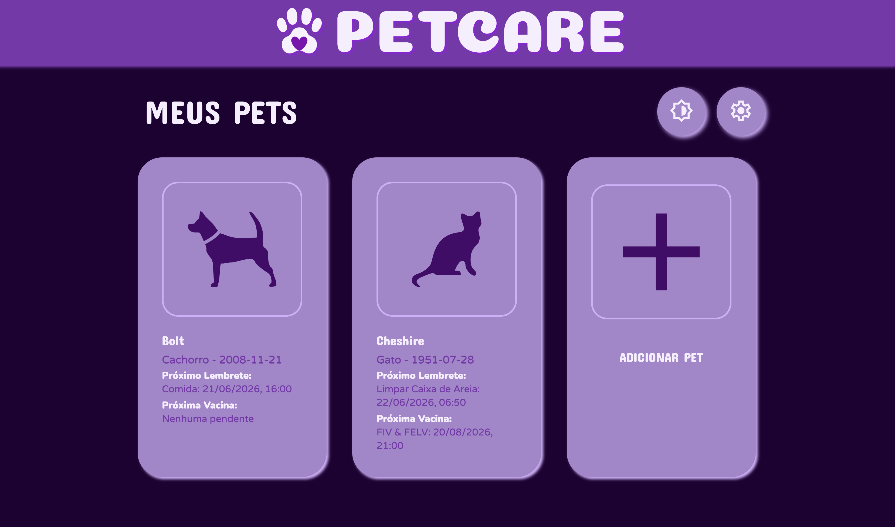

# PetCare

Aplicativo Electron para cadastro de pets com registros de lembretes e vacinas respectivos.

Permite adicionar, visualizar e excluir pets, lembretes e aplicações de vacina.

Desenvolvido como trabalho da faculdade de Análise e Desenvolvimento de Sistemas, baseado em projeto pessoal para aprendizado de HTML, CSS, JavaScript e SQLite.



# VERSÃO RELEASE 1.0 EM BREVE

## Roadmap

### Concluído

- Criar, editar e excluir pets;
- Criar, editar e excluir lembretes;
- Criar, editar e excluir doses de vacinas;
- Excluir todos os dados;
- Repetição de lembretes;
- Proxima dose de vacinas;
- Interface clara e escura;
- Upload de imagens + imagens padrão;

### Em Andamento
- Ativar Notificações;

### Updates Futuros
- Otimizações/reestruturação do código;
- Suporte para mais tipos de pets;
- Ajustes de interface;
- Outros temas coloridos;
- Suporte para outros idiomas;
- Mais configurações;

## Estrutura Atual
```
PetCare/
├── README.md
├── main.js
├── database.js
├── pets.db
├── package.json
├── package-lock.json
│
├── pages/
│   ├── index.html
│   ├── newPet.html
│   └── pet.html
│
├── scripts/
│   ├── index.js
│   ├── newPet.js
│   ├── pet.js
│   └── theme.js
│
├── styles/
│   ├── main.css
│   ├── assets.css
│   ├── base.css
│   ├── buttons.css
│   ├── cards.css
│   ├── form.css
│   ├── layout.css
│   ├── text.css
│   ├── theme.css
│   └── variables.css
│
├── assets/
├── fonts/
├── images/
└── node_modules/
```
